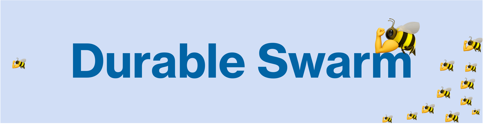

# DurableSwarm: Reliable Multi-Agent Orchestration

This repository augments [OpenAI's Swarm](https://github.com/openai/swarm/tree/main) with **durable execution** to help you build reliable, scalable multi-agent systems.

Durable Swarm is a drop-in replacement for Swarm that makes your agentic workflows **resilient to any failure**, so that if they are interrupted or restarted, they automatically resume from their last completed steps.
Under the hood, it uses [DBOS](https://github.com/dbos-inc/dbos-transact-py) to store your agentic workflows' execution state (which workflows are currently executing and which steps they've completed) in a Postgres database.

> [!NOTE]
> DurableSwarm currently doesn't support streaming

## Why Durable Execution?

As multi-agent workflows become more common, more long-running, and more interactive, it's important to make them be **reliable**.
If an agent spends hours waiting for user inputs or processing complex workflows, it needs to be robust to transient failures like a server restarting.
However, building reliable applications isn't easy&mdash;and you should be able to build a usable system without the complexity of using SQS or Kafka to communicate between agents.

Durable execution helps you write reliable agents while preserving the **ease of use** of a framework like Swarm.
The idea is to automatically store the execution state of your Swarm workflow in a Postgres database.
That way, if your program is interrupted, it can automatically resume your agentic workflows from the last completed step.

## Installation

Install [Swarm](https://github.com/openai/swarm/tree/main) and [DBOS](https://github.com/dbos-inc/dbos-transact-py) and initialize DBOS. Requires Python 3.10+.

```
pip install dbos git+https://github.com/openai/swarm.git
```

## Make Swarm Durable!

To add Durable Swarm to your project, simply create a `durable_swarm.py` file containing the following code:

```python
from swarm import Swarm
from dbos import DBOS, DBOSConfiguredInstance

DBOS()

@DBOS.dbos_class()
class DurableSwarm(Swarm, DBOSConfiguredInstance):
    def __init__(self, client=None):
        Swarm.__init__(self, client)
        DBOSConfiguredInstance.__init__(self, "openai_client")

    @DBOS.step()
    def get_chat_completion(self, *args, **kwargs):
        return super().get_chat_completion(*args, **kwargs)

    @DBOS.step()
    def handle_tool_calls(self, *args, **kwargs):
        return super().handle_tool_calls(*args, **kwargs)

    @DBOS.workflow()
    def run(self, *args, **kwargs):
        return super().run(*args, **kwargs)

DBOS.launch()
```

Then use `DurableSwarm` instead of `Swarm` in your applications&mdash;it's a drop-in replacement.

Under the hood, this works by declaring Swarm's main loop to be a durably executed workflow and each chat completion or tool call to be a step in that workflow.
DBOS persists the input of a workflow and the outputs of its steps in a Postgres database.
Therefore, if your workflow is ever interrupted, DBOS can automatically resume it from the last completed step!

## Usage

Create `main.py` and put this script in the same folder as `durable_swarm.py`:

```python
from swarm import Agent
from durable_swarm import DurableSwarm

client = DurableSwarm()

def transfer_to_agent_b():
    return agent_b


agent_a = Agent(
    name="Agent A",
    instructions="You are a helpful agent.",
    functions=[transfer_to_agent_b],
)

agent_b = Agent(
    name="Agent B",
    instructions="Only speak in Haikus.",
)

response = client.run(
    agent=agent_a,
    messages=[{"role": "user", "content": "I want to talk to agent B."}],
)

print(response.messages[-1]["content"])
```

Then, create a DBOS config file:
```
dbos init --config
```

If you already have a Postgres server, you can modify `dbos-config.yaml` to config the connection info.
Otherwise, you could start one locally:
```
python3 start_postgres_docker.py
```

Finally, run this script:
```
> python3 main.py

Agent B is here,
Ready to help you today,
What do you need, friend?
```

## Overview

DBOS is a lightweight durable execution library. All you need is a Postgres database.

## Examples

Updating your existing Swarm apps to use DurableSwarm is simple:
1. Add the `durable_swarm.py` file
2. Change your app to use `DurableSwarm` instead
3. Run `dbos init --config` in your app folder

Learn more about each example in its README. Durable Swarm supports all original examples, plus a modified agent to demonstrate durable workflows.

- [`basic`](examples/basic/): Simple examples of fundamentals like setup, function calling, handoffs, and context variables
- [`triage_agent`](examples/triage_agent/): Simple example of setting up a basic triage step to hand off to the right agent
- [`weather_agent`](examples/weather_agent/): Simple example of function calling
- [`airline`](examples/airline/): A multi-agent setup for handling different customer service requests in an airline context
- [`support_bot`](examples/support_bot/): A customer service bot which includes a user interface agent and a help center agent with several tools
- [`personal_shopper`](#): ~~A personal shopping agent that can help with making sales and refunding orders~~ (the original demo is broken)