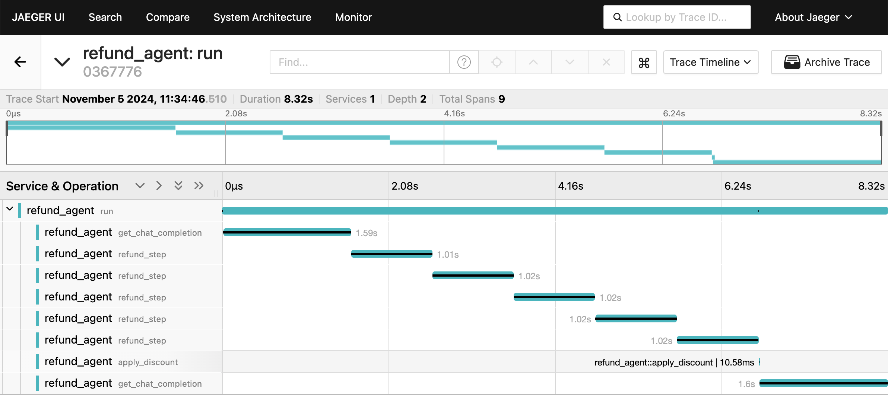

# Durable Refund Agent

This example uses Durable Swarm to orchestrate a refund agent.
It takes in a user's name, processes a refund for that user, then applies a discount.

The function for processing refunds takes a long time!
However, thanks to **durable execution**, even if the agent is interrupted during refund processing (or at any other time), upon restart it automatically recovers, finishes processing the refund, then proceeds to the next step in its workflow.


## Try it out!

To run the demo:

```shell
python3 main.py
```

You can press `Ctrl+C` at any point while the agent is processing your refund.
If you restart the program again, you'll see DBOS automatically recovers the incomplete workflow and resumes it from its last completed step.

For example:

```shell
> python3 main.py

Connecting to Durable Refund Agent 💪🐝
What's your name:
Qian
Refunding for Qian, item item_99, because Too expensive and didn't like the color...
Processing refund step 1... Press Control + C to quit
Processing refund step 2... Press Control + C to quit
Processing refund step 3... Press Control + C to quit
^C⏎

# Resume from where the last completed step (step 3), continuing with step 4.
> python3 main.py

Connecting to Durable Refund Agent 💪🐝
Refunding for Qian, item item_99, because Too expensive and didn't like the color...
Processing refund step 4... Press Control + C to quit
Processing refund step 5... Press Control + C to quit
Refund successfully processed!
Applying discount...
Refunds Agent:
process_refund("item_id"= "item_99", "reason"= "Too expensive and didn't like the color")
apply_discount()
Refunds Agent: Your refund for item 99 has been successfully processed, and I've also applied an 11% discount for your next purchase. If you need any further assistance, feel free to let me know!
```

## Viewing OpenTelemetry Traces

DBOS automatically constructs [OpenTelemetry traces](https://docs.dbos.dev/python/tutorials/logging-and-tracing#opentelemetry-export) of all workflows and their steps. You can use [Jaeger](https://www.jaegertracing.io/docs/latest/getting-started/) to visualize the traces.

Start a Jaeger all-in-one Docker container with a single command:
```shell
docker run --rm --name jaeger \
    -e COLLECTOR_ZIPKIN_HOST_PORT=:9411 \
    -p 6831:6831/udp \
    -p 6832:6832/udp \
    -p 5778:5778 \
    -p 16686:16686 \
    -p 4317:4317 \
    -p 4318:4318 \
    -p 14250:14250 \
    -p 14268:14268 \
    -p 14269:14269 \
    -p 9411:9411 \
    jaegertracing/all-in-one:1.62.0
```

After it starts, run refund agent several times, and then navigate to `http://localhost:16686/` to explore traces!

Here is an example screenshot, where you can clearly see each function call (`run`, `get_chat_completion`, `refund_step`, and `apply_discount`) and their latencies:


